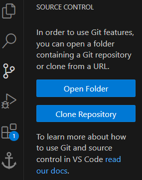

- [Extensions](#Extensions)
- [VS Code Settings](#VS%20Code%20Settings)
	- [Video: ](#Video:)
- [Starting a Django Project](#Starting%20a%20Django%20Project)
	- [Starting a Git and GitHub Project](#Starting%20a%20Git%20and%20GitHub%20Project)
		- [Local Repository](#Local%20Repository)
		- [GitHub Repository](#GitHub%20Repository)
		- [Video: ](#Video)
	- [Creating a venv in VS Code](#Creating%20a%20venv%20in%20VS%20Code)
		- [Steps:](#Steps:)
		- [Video: ](#Video:)
	- [Django Project Hacks](#Django%20Project%20Hacks)
		- [Previous Commands](#Previous%20Commands)
		- [Video ](#Video)
		- [Running Django](#Running%20Django)
		- [Video ](#Video)


# Extensions

One of the first things that will immediately improve your Django programming experience would some of the extensions available in the VS Code Extension Market

| Extension               |      Author      | Description                                                                                                                                                                                                             |
| ----------------------- | :--------------: | :---------------------------------------------------------------------------------------------------------------------------------------------------------------------------------------------------------------------- |
| **Auto Close Tag**      |     Jun Han      | Automatically add closing tag when you type in the closing bracket of the opening tag                                                                                                                                   |
| **Auto Rename Tag**     |     Jun Han      | Automatically rename paired `HTML`/`XML` tag                                                                                                                                                                            |
| **Django Support**      |     Al Mahdi     | Django template language syntax highlighting in `html`.<br><br>`(ctrl+click)` or `(cmd+click)` on path to jump to template from `html` or `python` file<br><br>templates / tags (ex. **`if`** ⟶ ` `) |
| **django-intellisense** |     shamanu4     | Autocomplete for all dynamic properties generated by Django.                                                                                                                                                            |
| **Flake8**              |    Microsoft     | Provides warnings relating PEP8                                                                                                                                                                                         |
| **Path Intellisense**   | Christian Kohler | Autocompletes filenames                                                                                                                                                                                                 |

# VS Code Settings

Certain helpful settings to improve some editor features. Just click the link and it will open the corresponding setting in VS Code. Brackets are important.

$_{\textrm{Note: These are my own personal settings. You may change them to your liking}}$

| Link to setting                                      | Value                                                      |
| ---------------------------------------------------- | ---------------------------------------------------------- |
| [Editor Rulers](vscode://settings/editor.rulers)     | [79]                                                       |
| [Flake8 Severity](vscode://settings/flake8.severity) | F401              Information<br>E501              Warning |
Refer to the following images for visual aid.

**Editor Rulers:**

<br>
**Flake8(PEP8) Style Warnings:**


##### Video:
TBC


---
# Starting a Django Project

### Starting a Git and GitHub Project

##### Local Repository
On the left hand side bar of VS Code, you will find the `Source Control` tab. Alternatively, you can press `Ctrl+Shift+G`

Click on `Initialize Repository` to create a local repository. From here you will be able to do anything Git related.



The current folder will be automatically tracked for changes. Create a text file as an example.
U ⟶ `Upload`
M ⟶ `Modified` (if the file has already been tracked/uploaded)
D ⟶ `Deleted`  (if you've deleted a tracked file)

Once you are ready to make a commit, type your commit message at the top. `Shift+Enter` to create a new line. Three spaces to recrate a `Tab`. You can press the `✓ Commit` button to commit the changes. Just press yes.


Alternatively you can leave it blank and a new editor window will open where you can write your commit message there. There will be a ✓ at the top right. Click that to commit.


##### GitHub Repository
Once you are ready to publish to GitHub, just click publish. You might have to Sign-In via GitHub. Just click yes and GitHub.com will open in your browser.


Once you've signed in you can choose between publishing to a private or public repository. You will only have to do this once.


All future commits will will require you to click the `⟲ Sync Changes` which will push all commits to GitHub.

To do other GitHub Commands, hover over `˅ Source Control` and you will see additional buttons. Hover over them to see what they do. The `⋯` button will reveal more GitHub options.


Alternatively, you can press `Ctrl+Shift+P` to open up your Command Pallet and type git to see what other GitHub commands you can do.

##### Video
TBC

---
### Creating a venv in VS Code

VS Code has automatic tools to help you create virtual environments in Python. Here is a Step by Step process of creating a venv.

##### Steps:
1) `Ctrl+Shift+P` ⟶ Python: Select Interpreter


<br>
2) ➕ Create Virtual Environment


<br>
3) For the purposes of our class we will be using `venv`

<br>
4) Select a Python version. Most cases, the most recent Python version that is installed in your system will be fine.

<br>
5) A `.venv` folder will be created. If any errors appear, just restart the process. If issues persist, contact me
6) If a VS Code Terminal is currently open. You will need to close it and re-open it for the `.venv` to be automatically activated. 
7) You will only need to create the `.venv` once per project.

##### Video:
Here is a video recreation of all the steps to act as visual aid.
TBC

---
### Django Project Hacks

To create a django project, you can just follow the Lecture slides. Pretty much everything you need to know is there. Here are some 'Hacks' or tricks you can use to make dealing with Django easier.

##### Previous Commands
In the terminal, to repeat any command you've already typed you can press `Ctrl+R`. The text `bck-i-search` will appear and you can type keywords for commands that you have entered before.


Try it out to see how it works. Its more intuitive than you think. `Ctrl+R` to iterate through matching options. So if there are multiple commands that match the input keyword, you can cycle through that list using `Ctrl+R`


##### Video
TBC

##### Running Django
Instead of running `py manage.py runserver` each time, we can create a launch file to automatically launch Django with a single button press.

To create a launch file. Click on the `Run and Debug` button on the left ribbon bar that looks like a play button. You can also press `Ctrl+Shift+D` to open the menu.


From there you can click on the `create a launch.json file` link and click Web App (Chrome). A text editor will open and you can just replace that file with the following.

```json
{
	// Use IntelliSense to learn about possible attributes.
	// Hover to view descriptions of existing attributes.
	// For more information, visit: https://go.microsoft.com/fwlink/?linkid=830387
	
	"version": "0.2.0",
	"configurations": [
		{
		    "name": "Django Debugger",
		    "type": "debugpy",
		    "request": "launch",
		    "python": "${workspaceFolder}\\.venv\\Scripts\\python",
		    "program": "${workspaceFolder}\\hobbysite\\manage.py",
		    "args": ["runserver"],
		    "django": true,
		    "justMyCode": true,
		    "serverReadyAction": {
			"pattern": "Starting development server at http://127.0.0.1:([0-9]+)",
			"uriFormat": "http://localhost:%s/${input:webpage}"
		    }
		}
	],
	"inputs": [
		{
		    "id": "webpage",
		    "type": "promptString",
		    "description": "Opens Specified Sub-Page at Launch",
		    "default": ""
		}
	]
}
```

DO NOT FORGET TO REPLACE `hobbysite` WITH THE NAME OF YOUR DJANGO PROJECT


##### Video
TBC
