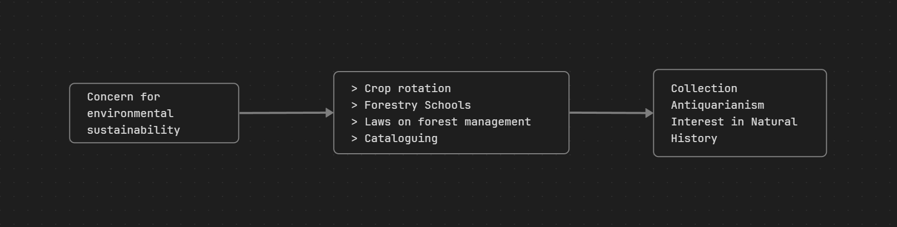

- [Day 1](#Day%201)
	- [Main Advocacies and Evolution](#Main%20Advocacies%20and%20Evolution)
- [Day 2](#Day%202)
	- [Early Environmentalism](#Early%20Environmentalism)
		- [Historical Perceptions of Nature and the Environment](#Historical%20Perceptions%20of%20Nature%20and%20the%20Environment)
		- [Medieval Period (Europe)](#Medieval%20Period%20(Europe))
	- [Renaissance Environmentalism](#Renaissance%20Environmentalism)
		- [Age of Reason, Enlightenment, and Capitalism](#Age%20of%20Reason,%20Enlightenment,%20and%20Capitalism)
		- [Forestry and Natural History](#Forestry%20and%20Natural%20History)
		- [Gardens of Eden](#Gardens%20of%20Eden)
		- [Romanticizing Nature](#Romanticizing%20Nature)
		- [Beach, Beauty, and Beer - Nature Tourism](#Beach,%20Beauty,%20and%20Beer%20-%20Nature%20Tourism)
		- [The Adorable, The Abominable, and Hoomans](#The%20Adorable,%20The%20Abominable,%20and%20Hoomans)
	- [Urbanization and Industrialization](#Urbanization%20and%20Industrialization)
		- [Industrial Revolution](#Industrial%20Revolution)
		- [Urbanization](#Urbanization)
		- [Conservation](#Conservation)
		- [Reintegration of Nature in the Urban](#Reintegration%20of%20Nature%20in%20the%20Urban)
		- [Preservation](#Preservation)
	- [Conservation and Preservation](#Conservation%20and%20Preservation)
		- [Reasons for participating in Activism](#Reasons%20for%20participating%20in%20Activism)
	- [The Post-War Affluent Western Society](#The%20Post-War%20Affluent%20Western%20Society)
		- [The Climax Community](#The%20Climax%20Community)
		- [Aldo Leopold](#Aldo%20Leopold)
	- [Part 1 Key Points](#Part%201%20Key%20Points)
	- [The Counter-Culture Spirit](#The%20Counter-Culture%20Spirit)
	- [The Environmental Revolution](#The%20Environmental%20Revolution)
		- [DDT Pesticides](#DDT%20Pesticides)
	- [Green Movement and the Aftermath](#Green%20Movement%20and%20the%20Aftermath)
		- [Sustainable Development](#Sustainable%20Development)
	- [Summary](#Summary)
		- [Quiz - Short Answer Questions](#Quiz%20-%20Short%20Answer%20Questions)
		- [Glossary of Key Terms](#Glossary%20of%20Key%20Terms)
		- [How did different cultures historically perceive nature?](#How%20did%20different%20cultures%20historically%20perceive%20nature?)
		- [How did the Renaissance period transform human perception and interaction with nature in the West?](#How%20did%20the%20Renaissance%20period%20transform%20human%20perception%20and%20interaction%20with%20nature%20in%20the%20West?)
		- [What was the impact of the Industrial Revolution on human-nature relationships and the environment?](#What%20was%20the%20impact%20of%20the%20Industrial%20Revolution%20on%20human-nature%20relationships%20and%20the%20environment?)
		- [What are the main differences between "conservation" and "preservation" in environmentalism?](#What%20are%20the%20main%20differences%20between%20%22conservation%22%20and%20%22preservation%22%20in%20environmentalism?)
		- [How did the concept of "nature loving" evolve and what societal trends influenced it?](#How%20did%20the%20concept%20of%20%22nature%20loving%22%20evolve%20and%20what%20societal%20trends%20influenced%20it?)
		- [How did the rise of industrialization lead to a "return to the countryside" and the development of urban parks?](#How%20did%20the%20rise%20of%20industrialization%20lead%20to%20a%20%22return%20to%20the%20countryside%22%20and%20the%20development%20of%20urban%20parks?)
		- [What role did natural history and collecting play in shaping European views of nature during the Renaissance and subsequent centuries?](#What%20role%20did%20natural%20history%20and%20collecting%20play%20in%20shaping%20European%20views%20of%20nature%20during%20the%20Renaissance%20and%20subsequent%20centuries?)
		- [In what ways did early environmental movements in different countries reflect national identity and class dynamics?](#In%20what%20ways%20did%20early%20environmental%20movements%20in%20different%20countries%20reflect%20national%20identity%20and%20class%20dynamics?)
	- [Dominion to Conservation](#Dominion%20to%20Conservation)
		- [Global Differences in Historical Perceptions of Nature](#Global%20Differences%20in%20Historical%20Perceptions%20of%20Nature)
		- [Medieval Period (Europe) - Dominion and Anthropocentrism](#Medieval%20Period%20(Europe)%20-%20Dominion%20and%20Anthropocentrism)
		- [Renaissance Environmentalism - Mastery, Reason, and Early Concerns](#Renaissance%20Environmentalism%20-%20Mastery,%20Reason,%20and%20Early%20Concerns)
		- [Industrialization and Urbanization - Shifting Landscapes and Environmental Responses](#Industrialization%20and%20Urbanization%20-%20Shifting%20Landscapes%20and%20Environmental%20Responses)
		- [Industrialization's Ambiguous Relationship with Nature Loving](#Industrialization's%20Ambiguous%20Relationship%20with%20Nature%20Loving)
		- [Key Figures and Their Contributions](#Key%20Figures%20and%20Their%20Contributions)
		- [Core Concepts and Ideas](#Core%20Concepts%20and%20Ideas)
		- [Key Events and Movements](#Key%20Events%20and%20Movements)
		- [Regional Differences in Environmentalism (Western Europe Focus)](#Regional%20Differences%20in%20Environmentalism%20(Western%20Europe%20Focus))
		- [Environmental Activism](#Environmental%20Activism)
		- [Answer Key](#Answer%20Key)
		- [Glossary of Key Terms](#Glossary%20of%20Key%20Terms)

## Day 1
The Sierra Club, founded in **1892 by John Muir**, has historically been a significant advocate for environmental preservation in the United States.

### Main Advocacies and Evolution

- **Early Advocacies (Late 19th - Mid-20th Century)**:
	- Initially, the Sierra Club served as the primary advocate for the **preservation of large parks in the US**.
	- It spearheaded efforts to set aside **millions of acres of land specifically for wilderness**, a pioneering initiative that ultimately led to the Wilderness Act of 1964.
	- The organization successfully opposed the construction of dams in significant natural areas, including the Dinosaur National Monument and the Grand Canyon. These actions demonstrated its commitment to **wilderness preservation over economic development**. One of its former leaders, David Brower, proclaimed his allegiance to "wilderness for itself alone".
- **Growth and Mainstream Influence (1960s onwards)**:
	- The Sierra Club experienced substantial growth in membership, increasing from 20,000 in 1959 to 113,000 by 1970.
	- By the 1970s, and continuing into the 21st century, it established itself as **one of the most influential and well-funded environmental organizations in North America**, leveraging its Legal Defense Fund and lobbying activities.
	- As a mainstream environmental group, the Sierra Club adopted an **anthropocentric approach**, prioritizing the use of nature for the benefit of present and future human generations. This contrasts with more radical groups that emerged later, which hold biocentric beliefs, valuing nature intrinsically, irrespective of its human utility.
- **Changes and Perceived Moderation**:
	- By the 1970s, the Sierra Club was perceived by some as having been **eclipsed by more radical environmental groups**.
	- A segment of activists became disillusioned with mainstream organizations like the Sierra Club, viewing them as **ineffective, overly compromising, and bureaucratic**.
	- This dissatisfaction led prominent figures, such as David Brower, to leave the Sierra Club in 1970 and co-found more radical groups like Friends of the Earth. Similarly, Dave Foreman, a co-founder of Earth First!, explicitly stated his desire to create a radical wing that would make the Sierra Club "look moderate".
	- This shift indicates that while the Sierra Club remained a powerful force, its approach became seen as more moderate compared to the increasingly radical environmental movements advocating for more profound systemic changes beyond mere conservation or pollution control.
--- 
When the Sierra Club first started, its main advocacies were primarily focused on the preservation of natural landscapes and wilderness areas in the United States.

The main advocacies of the Sierra Club when it first started include:

- **Preservation of Large Parks:** For several decades after its founding in 1892 by John Muir, the Sierra Club was the **principal advocate for the preservation of large parks in the US**.
- **Setting Aside Wilderness:** It initiated and led efforts to **set aside millions of acres of land specifically for wilderness**. This was considered an unprecedented effort that ultimately led to the **Wilderness Act of 1964**.
- **Opposition to Damming Natural Areas:** The organization successfully campaigned against the construction of dams in significant natural sites, specifically **opposing the damming of the Grand Canyon and a dam in Dinosaur National Monument**. This demonstrated a commitment to **wilderness preservation over economic development**. David Brower, a former leader, expressed allegiance to "wilderness for itself alone".
--- 
## Day 2

### Early Environmentalism
#### Historical Perceptions of Nature and the Environment
1. Powerful, animate world that can bestow or withhold resources
2. Potent force that humans ought to contemplate and learn from
3. Untamed nature as a threat to survival, livelihoods, and salvation, and thus something to be dominated
#### Medieval Period (Europe)
- Earth-centric and deterministic
- Man has God-given dominion over nature for "sustenance"
- The tame >> the unknown and uninhabited
### Renaissance Environmentalism
#### Age of Reason, Enlightenment, and Capitalism
> "Why should I insist on the great plenty of Waters brought from the most remote and hidden Places, and employed to so many different and useful Purposes? Upon Trophies, Tabernacles, sacred Edifices, Churches and the like, adapted to divine Worship and the Service of Posterity? Or lastly, why should I mention the Rocks cut, Mountains bored through, Vallies filled up, Lakes confined, Marshes discharged into the Sea, Ships built, Rivers turned, their Mouths cleared, Bridges laid over them, Harbours formed, not only serving to Men's immediate Conveniences, but also opening them a way to all Parts of the World"
#### Forestry and Natural History

#### Gardens of Eden
- Provided a foil to wild landscapes
- Showed man's mastery of nature and ability to collect exotic pieces
#### Romanticizing Nature
...
#### Beach, Beauty, and Beer - Nature Tourism
- Rural Tourist Industry
- Fear of urbanizing the rural
- A "proper" way to appreciate nature
- Making the experience comfortable
- The paradox of appreciation and exploitation
#### The Adorable, The Abominable, and Hoomans
- The Society of Prevention of Cruelty to Animals (SPCA), London 1820s
### Urbanization and Industrialization
#### Industrial Revolution
- General increase in consumption of fossil fuels
- Results in the general increase of Carbon Dioxide
#### Urbanization
- Economic activity concentrated in high population density locations --> capitalism cutting costs of production in rural areas
- Start of a wave of forest loss
#### Conservation
- "Planned Management"
- **Gifford Pinchot** --> one of the earliest conservationists
- Appointed as head of the Division of Forestry in US (1898)
- Advocated scientific management, sustainable yield, full utilization, fire prevention, reforestation

> *"When there's smook, there is brass"* --> pollution $=$ economic progress

#### Reintegration of Nature in the Urban 
- Urban Parks were more easily established because they did not threaten the status quo
- <u>**Return to the country**</u>: widely-spread suburban homes with gardens, separated by ample wood
- Industrialization brought people to the cities but also provided both the means and the motive to travel from the city to the countryside
- An increase in perceived manliness by being capable in nature
	- Boy Scouts (1907) England
	- Characters like Tarzan
	- "Civilization" --> love for nature
	- A "civilized way" of loving nature
#### Preservation
> *"Keep close to nature's heart
> And break clear away,
> Once in a while,
> And climb a mountain
> Or spend a week in the woods.
> Wash your spirit clean"*
- John Muir (1838-1914) --> "John of the Mountains", "Father of the National Parks"
- Advocate of <mark class="hltr-yellow">preservation</mark>
	- Maintain the presently "wild" condition, valuing nature for its transcendental, spiritual values
	- First President of the Sierra Club
	- Extended National Integrated Protected Areas System (ENIPAS) (RA 11038, s2018)
		- **effective administration of this area is possible only through cooperation among national government, local government and concerned private organizations ~={PastelGreen}(and concerned non-government organizations and local communities)=~**
		- ~={PastelGreen}The System shall recognize conservation areas and management regimes being implemented by local government units, local communities, and indigenous people=~
		- ~={PastelGreen}As part of heritage preservation and pursuant to the need to conserve biologically significant areas, the territories and areas occupied and conserved for and by IPs and communities shall be recognized, respected, developed, and promoted.  =~
		- ~={PastelGreen}The ICCs and IPs shall have the responsibility to govern, maintain, develop, protect, and conserve such areas, in accordance with their IKSP and customary law, with full and effective assistance from the NCIP, DENR, and other concerned government agencies...=~

> *"In the end, nature-loving was not enough to curtail degradation of natural resources for economic progress—it focused on what was beautiful, spiritual, recreational, and turned almost a blind eye to what was degraded to achieve the comforts of the Industrial Age"*

### Conservation and Preservation

| **Conservation**                                                    | **Preservation**                                    |
| ------------------------------------------------------------------- | --------------------------------------------------- |
| Advocate for Maximum but sustainable use of environmental resources | Advocate for limited use of environmental resources |
| "Use as much as we can without collapsing the environment"          | "Use a little as possible form the environment"     |

In the Global South, it is led mostly by people instead of NGOs, but the motive behind campaigns vary.

It started mostly with government-imposed conservation and preservation, but over time government and organization found themselves in either end of the spectrum

#### Reasons for participating in Activism
1. Biographical Availability
	- Refers to the absence of personal constraints that might make it more difficult or risky for individuals to participate in activism
	- Absence of personal constrains
	- ex. --> full-time employment, family responsibilities, or other commitments that require significant time and resources
2. Structural Availability
	- Refers to the extent to which an individual's social roles and obligations allow them the time and the freedom to participate in social movements or activism
	- Position within social networks and their access to information about mobilization opportunities
3. Political Engagement
	- Encompasses an individual's interest, knowledge and perceived efficacy in the political sphere
	- ex. --> individuals with strong political engagement may be more likely to seek  out opportunities to express their views through activism
### The Post-War Affluent Western Society
- The idea of creating a home included bringing nature into the home space
#### The Climax Community
- Nature became accessible and predictable
- Challenged the antagonistic view of some animals and challenged human intervention
#### Aldo Leopold 
> *"We abuse land because we regard it as a commodity belonging to us. When we see it as a community to which we belong, we may begin to use it with love and respect"*

### Part 1 Key Points
1. The ability to "**own**" a garden is telling of a mindset that nature can be "**owned**" and that it exists for the enjoyment of humans
2. The distinction between "**friendly**" and "**unfriendly**" leads us to the discrimination and destruction of some habitats and species and the protection of others
3. We are often more concerned about how we can benefit from being close to nature as opposed to how nature can benefit from being left alone
### The Counter-Culture Spirit
- The rise in the 70s movements
- Modernization vs Social and Environmental movements
- ... 

### The Environmental Revolution
#### DDT Pesticides
- **~={PastelRed}Chemically extremely stable=~** --> the persist more or less unchanged in the environment for many years
- **~={PastelRed}Highly soluble in fat=~** --> they can accumulate in animal bodies until they reach l;
- **~={PastelRed}High dispersal over wide areas=~** --> through bodies of migrant animals, in air, and in water currents. They affect populations far removed from the areas of manufacture and use
### Green Movement and the Aftermath
- Institutionalization of Environmental Concern
- Rise of Environmental NGOs, green parties & politics, and green rhetoric
	- IUCN
	- UNESCO
	- WHO
	- FAO - Fiat Panis
	- GreenPeace (1971, Canada)
	- Friends of the Earth (1969, San Fran -> 1971, International)
	- Rio de Janeiro Earth Summit (1992)
		- created UNFCCC
		- Resulted in Agenda 21 --> Conservation and Management of Resources Development
		- Led to the <u>Kyoto Protocol</u> five years later (International agreement to ↓ GHG emissions)
- Globalization of environmental concern
- Radicalization and non-violent direct action
#### Sustainable Development
-  The kind of development that meets the needs of the present without compromising the ability of future generations to meet their own needs

- Executive Order No. 192, s1987
	- <mark class="hltr-yellow">Ensure the equitable sharing of the benefits derived therefrom for the welfare of the present and future generations of Filipinos</mark>
	- Assure the availability and <mark class="hltr-yellow">sustainability</mark> of the country's natural resources
	- Conserve specific terrestrial and marine areas representative of the Philippine natural and cultural heritage for <mark class="hltr-yellow">present and future generations</mark>
- Environmental Impact Assessment
	- "*...encourage the <mark class="hltr-red">widest exploitation</mark> of the environment without degrading it, or endangering human life*" --> Radicalization of environmental movements
--- 
### Summary 
#### Quiz - Short Answer Questions

1. **How did different global cultures perceive nature and the environment, according to the provided sources?** Indigenous peoples and East Asians often saw nature as a powerful, animate world that could bestow or withhold resources, and a potent force to contemplate and learn from. In contrast, Christians viewed untamed nature as a threat to survival and salvation, needing to be dominated.
2. **Describe the Medieval European perception of nature. What was the significance of "the tame" over "the unknown and uninhabited"?** Medieval Europe held an Earth-centric and deterministic view, believing man had God-given dominion over nature for sustenance. "The tame" represented cultivated, productive land that was safe and useful, contrasting with "the unknown and uninhabited" wild places perceived as chaotic and threatening, possibly associated with evil.
3. **Explain how the Age of Reason, Enlightenment, and Capitalism influenced the human relationship with nature.** This era, marked by economic and scientific transformations, fostered a less fearful and more confident approach to nature, viewing it as a collection of inert materials to be manipulated. It accelerated processes like agriculture, transportation, and industry, leading to increased exploitation of resources for human ends.
4. **What was the primary concern that led to the development of forestry and natural history during the Renaissance and Enlightenment?** Growing concerns about the consequences of shrinking forests, such as landslides and floods, and the need for a reliable supply of timber led to the emergence of forestry schools and laws. Natural history also arose from an interest in cataloguing and collecting flora and fauna, often to assess their commercial and agricultural potential.
5. **How did "Gardens of Eden" reflect humanity's relationship with nature during the Renaissance?** These elaborate gardens served as a foil to wild landscapes, demonstrating mankind's mastery over nature by making it orderly and pleasant. They also symbolized humanity's ability to collect and control exotic plants, and in some cases, suggested a monarch's supernatural command over their nation.
6. **Discuss the paradox inherent in "Nature Tourism" during the Renaissance period.** Nature tourism encouraged people to appreciate nature for its beauty and restorative qualities, often escaping the "disorder and false values" of the city. However, it also presented a paradox where the very act of appreciating nature led to its commercialization and exploitation, making the experience more comfortable but less elemental.
7. **What was the significance of the founding of the Society for the Prevention of Cruelty to Animals (SPCA) in the 1820s?** The SPCA's founding in London in the 1820s marked a growing concern for animal welfare in Western society. It represented a shift in human-animal relationships, moving beyond purely utilitarian views to advocate for the protection and ethical treatment of animals, especially those seen as loyal or useful, although this sympathy was often conditional.
8. **Differentiate between "Conservation" and "Preservation" as concepts in environmentalism.** Conservation advocates for the maximum but sustainable use of environmental resources, emphasizing scientific management, sustainable yield, and full utilization (e.g., Gifford Pinchot). Preservation, on the other hand, argues for limited or no use of environmental resources, valuing nature for its intrinsic, spiritual, and transcendental qualities (e.g., John Muir).
9. **How did the Industrial Revolution impact forest cover in regions like Europe and North America?** The Industrial Revolution, occurring from the mid-19th to mid-20th century, led to significant deforestation. Graphs show a sharp decline in forest cover in Europe and North America, with a corresponding increase in cropland and grazing land, demonstrating the extensive land use changes driven by industrial and agricultural expansion.
10. **Explain how the concept of "pollution = economic progress" was perceived during the Industrial Revolution.** During the Industrial Revolution, pollution, particularly smoke from factories, was often seen as a sign of economic progress and prosperity, encapsulated by the phrase "When there's smook, there is brass." This mindset meant that workers and industrialists were often reluctant to support anti-pollution measures that might jeopardize their jobs or impede industrial development.
#### Glossary of Key Terms

- **Anthropocentrism:** A worldview centered on human beings, considering humanity as the most important element of existence, often viewing nature primarily in terms of its utility to humans.
- **Antiquarianism:** An interest in collecting and studying ancient artifacts and relics, often linked in the sources to a broader interest in natural history and the cataloguing of the natural world.
- **Conservation:** An environmental philosophy that advocates for the efficient and sustainable use of natural resources to ensure their availability for present and future generations. Key figures like Gifford Pinchot are associated with this approach.
- **Crop Rotation:** An agricultural practice of growing different types of crops in the same area in sequenced seasons to improve soil health, optimize nutrients, and combat pest and weed pressure. Mentioned as a concern for environmental sustainability in the Renaissance.
- **Deterministic (Earth-centric worldview):** A medieval European belief system where the Earth was considered the center of the universe, and human life and fate were largely seen as predetermined by natural and divine forces.
- **Dominion (over nature):** A concept, particularly prevalent in Judeo-Christian thought, that humans are given authority and control over the natural world.
- **Enlightenment:** An intellectual and philosophical movement in the 17th and 18th centuries emphasizing reason, individualism, and scientific inquiry, which contributed to a more confident, utilitarian view of nature.
- **Forestry Schools:** Institutions established to train individuals in the scientific and systematic management of forests, emerging during the Renaissance/Enlightenment due to concerns about timber supply and forest degradation.
- **Gardens of Eden:** During the Renaissance, elaborate cultivated gardens that symbolized human control and mastery over nature, often showcasing exotic plants and intricate design, serving as a contrast to wild landscapes.
- **Great Divergence:** Refers to the period when Western Europe and parts of North America experienced rapid economic growth and industrialization, diverging from other regions of the world, leading to significant environmental impacts.
- **Homo Ludens:** A concept proposed by Johan Huizinga, defining humanity not just as "man the worker" or "man the wise," but as "man at play," reflecting the Renaissance focus on creative imagination and the creation of alternative realities.
- **Humanism (Renaissance):** A philosophical and intellectual movement during the Renaissance that emphasized human potential, achievement, and individual self-affirmation, often leading to a focus on human mastery over nature.
- **Industrial Revolution:** A period from the mid-19th to mid-20th century characterized by rapid industrialization, urbanization, and technological advancements, which profoundly impacted human-environment interactions through increased resource consumption and pollution.
- **John Muir:** A prominent advocate for preservation, known as "John of the Mountains" and "Father of the National Parks," who emphasized the transcendental and spiritual value of wild nature and co-founded the Sierra Club.
- **Natural History:** The scientific study of organisms and natural objects, often involving observation, collection, and classification. It gained popularity during the Renaissance and Enlightenment as a means to catalogue and understand the natural world.
- **Nature Tourism:** The practice of traveling to natural areas for recreation, aesthetic appreciation, or outdoor activities. During the Renaissance, it emerged as a response to urbanization but also introduced a paradox of appreciating nature while facilitating its commercialization.
- **National Integrated Protected Areas System (NIPAS):** A Philippine legal framework (RA 7586, s1992, amended by RA 11038, s2018) for the establishment and management of protected areas, emphasizing biodiversity conservation, sustainable development, and the recognition of indigenous peoples' rights and traditional knowledge.
- **"Pot Hunters" vs. "Sport Hunters":** A social distinction that emerged in the late 19th/early 20th century. "Pot hunters" were typically poorer, rural residents who hunted for subsistence, while "sport hunters" were often wealthier recreational hunters who advocated for regulated hunting and protected areas.
- **Preservation:** An environmental philosophy that advocates for maintaining natural environments in their pristine or "wild" condition, with limited human intervention, often valuing nature for its intrinsic worth.
- **Romanticizing Nature:** A cultural movement, particularly during the Romantic era, that celebrated nature for its beauty, emotional resonance, and spiritual significance, often as a counterpoint to the perceived artificiality of urban life.
- **Royal Society for the Prevention of Cruelty to Animals (RSPCA):** Founded in 1824 in London (initially SPCA), it was a pioneering organization dedicated to preventing cruelty to animals and promoting animal welfare through lobbying for legislation and public awareness.
- **Scientific Management (of forests):** An approach to forestry, advocated by figures like Gifford Pinchot, that applies scientific principles to manage forests for sustained yield and maximum utility, including fire prevention and reforestation.
- **Sierra Club:** An environmental organization founded in 1892 by John Muir, focused on wilderness preservation and the establishment of national parks.
- **Sublime (nature):** A concept in aesthetics, particularly during the Romantic period, describing nature that inspires awe, terror, or overwhelming emotion due to its grandeur and power, contrasting with the merely "picturesque."
- **Sustainable Yield:** A principle in resource management, particularly forestry, that involves harvesting resources at a rate that allows them to regenerate, ensuring a continuous supply.
- **The Tame vs. The Unknown/Uninhabited:** A medieval and early modern European dichotomy where "the tame" referred to domesticated, cultivated, and controlled landscapes, while "the unknown and uninhabited" represented wild, dangerous, and uncivilized nature.
- **Urbanization:** The process of population shift from rural areas to cities, leading to the growth of urban areas. During the Industrial Revolution, this concentrated people and led to both environmental problems and new forms of nature appreciation (e.g., urban parks).
- **Wilderness:** Areas of natural environment that have not been significantly modified by human activity. The concept of wilderness gained appreciation for its spiritual and restorative qualities, particularly during the preservation movement.
- **Zapovedniki:** The term for national parks or nature preserves in the Soviet Union, established in the early 20th century. While initially for conservation, their management often prioritized utilitarian ends and economic productivity.
--- 
#### How did different cultures historically perceive nature?

Historically, perceptions of nature varied significantly across different cultures. Some, like various Indigenous peoples, viewed the world as a powerful, animate entity capable of bestowing or withholding resources, emphasizing dependence on it. East Asian philosophies often saw nature as a potent force from which humans ought to contemplate and learn. In contrast, medieval Christians, influenced by scriptures like Genesis 1:28 and Psalm 115:16, largely perceived untamed nature as a threat to survival, livelihoods, and salvation, something to be subdued and dominated. This led to a belief in human dominion over nature for "sustenance," valuing domesticated and "tame" environments over the wild and uninhabited.

#### How did the Renaissance period transform human perception and interaction with nature in the West?

The Renaissance marked a significant shift towards humanism and anthropocentrism, often termed "The Right Stuff" or "Hubris," emphasizing the conquest of nature. This era, characterized by the Age of Reason, Enlightenment, and Capitalism, saw humans asserting themselves as a "godlike creative force" separate from and superior to nature. Scientists like Galileo and Descartes began to view nature as passive and mechanistic, a collection of inert materials to be manipulated for human ends. This era saw a rise in forestry and natural history, but often with an emphasis on cataloguing, collecting, and mastering nature rather than appreciating its intrinsic value. Gardens of Eden, for example, were designed to showcase human mastery and the collection of exotic species, acting as a foil to wild landscapes.

#### What was the impact of the Industrial Revolution on human-nature relationships and the environment?

The Industrial Revolution, spanning from the mid-19th to mid-20th century, profoundly altered human-nature relationships, leading to extensive urbanization and increased pressure on natural resources. The dramatic rise in built-up areas, grazing lands, and croplands, as shown in the "Land use over the long-term" chart, reflects this expansion and the resulting forest cover loss in regions like New England, Europe, North America, and the Philippines. Industrialization also brought severe pollution, with factory smoke becoming a common sight, often associated with economic progress ("When there's smook, there is brass"). This period saw an unprecedented consumption of natural resources, raising concerns about their sustainability.

#### What are the main differences between "conservation" and "preservation" in environmentalism?

Conservation and preservation are two distinct, yet often related, approaches to environmentalism. **Conservation** advocates for the maximum but sustainable use of environmental resources. The philosophy is to "use as much as we can without collapsing the environment," focusing on planned management, sustainable yield, full utilization, fire prevention, and reforestation. Gifford Pinchot, head of the Division of Forestry in the US in 1898, was a key figure in this movement. **Preservation**, on the other hand, advocates for limited use of environmental resources, aiming to "use as little as possible from the environment" to maintain their wild condition. John Muir, known as "John of the Mountains" and "Father of the National Parks," was a strong proponent of preservation, valuing nature for its transcendental and spiritual qualities.

#### How did the concept of "nature loving" evolve and what societal trends influenced it?

The concept of "nature loving" evolved significantly, influenced by Romanticism and the impacts of industrialization and urbanization. Romanticizing nature, exemplified by poets like William Wordsworth and John Keats, saw nature as a source of spiritual inspiration and a counter-force to the artificiality of civilization. This led to an interest in rural tourism, where people sought comfort and an escape from urban life, creating a "rural tourist industry" and a "proper" way to appreciate nature, albeit sometimes with a paradox of appreciation and exploitation. Alongside this, organizations like the Society for the Prevention of Cruelty to Animals (SPCA) emerged, reflecting a growing concern for animal welfare, albeit often distinguishing between "adorable" and "abominable" animals.

#### How did the rise of industrialization lead to a "return to the countryside" and the development of urban parks?

Industrialization led to a significant migration of people to cities, causing concerns about urban degradation and the loss of connection to nature. In response, there was a movement to "return to the countryside," facilitated by improved transportation like railroads and automobiles. This manifested in the development of widely-spread suburban homes with gardens and the establishment of urban parks. Urban parks were more readily accepted as they did not threaten the existing industrial status quo. These movements aimed to provide city dwellers with access to nature, fresh air, and a sense of tranquility, counterbalancing the perceived "disorder and false values" of the city.

#### What role did natural history and collecting play in shaping European views of nature during the Renaissance and subsequent centuries?

Natural history and collecting were significant during the Renaissance and Age of Enlightenment. This interest was fueled by a desire to understand the commercial and agricultural potential of newly explored lands. Botanists and other collectors, initially including explorers like Captain James Cook, meticulously catalogued flora and fauna, contributing to scientific knowledge and demonstrating humanity's growing mastery over the natural world. This practice also became a popular pastime for the middle class in the 19th century, with many homes featuring aquariums, shell collections, or butterfly cabinets, signifying a "taste for natural history." This emphasis on classification and collection reflected a view of nature as a static, manipulable entity rather than a dynamic ecosystem.

#### In what ways did early environmental movements in different countries reflect national identity and class dynamics?

Early environmental movements often intertwined with national identity and class dynamics. In the US, the establishment of national parks like Yellowstone was tied to American nationalism and the idea of preserving unique wilderness. In countries like Germany, nature loving became associated with national essence, with Nazi leaders venerating landscapes alongside industrial growth, even using environmental rhetoric to justify racial ideologies. In former colonies, the notion of efficient resource consumption often faced criticism, reflecting different motivations for environmental campaigns in the Global South, where movements are often people-led rather than NGO-led. Furthermore, within Western societies, class divisions influenced how nature was accessed and appreciated, with the wealthy seeking comfort and leisure in natural settings, sometimes at the expense of local communities or traditional uses of land. The rise of recreational hunting, for instance, led to conflicts between "sport hunters" and "pot hunters," highlighting a class-based distinction in the use and perception of wildlife.

--- 
### Dominion to Conservation

This briefing document synthesizes key themes from the provided sources, outlining the historical evolution of human perceptions and interactions with nature, particularly focusing on the shift from a view of domination to one of conservation and preservation. It highlights global differences in these perceptions, the impact of significant historical periods like the Medieval and Renaissance eras, and the profound changes brought about by industrialization and urbanization.

#### Global Differences in Historical Perceptions of Nature

Historically, human societies have viewed nature through vastly different lenses:

- **Animate and Resourceful World:** Some cultures perceived nature as "a powerful, animate world that can bestow or withhold resources" ("5 - Early Environmentalism.pdf"). This perspective often fostered a sense of dependence and respect for natural forces.
- **Potent Force to Contemplate:** Other views emphasized nature as "a potent force that humans ought to contemplate and learn from" ("5 - Early Environmentalism.pdf"). This suggests a more reflective and perhaps spiritual relationship.
- **Threat to be Dominated:** In contrast, a dominant Western perspective, particularly as it evolved, saw "untamed nature as a threat to survival, livelihoods, and salvation, and thus something to be dominated" ("5 - Early Environmentalism.pdf"). This view is strongly linked to Judeo-Christian interpretations and the drive for human control and progress.

#### Medieval Period (Europe) - Dominion and Anthropocentrism

During the Medieval Period in Europe, the prevailing view was **earth-centric and deterministic** ("5 - Early Environmentalism.pdf"). This period was characterized by:

- **God-given Dominion:** The belief that "Man has God-given dominion over nature for 'sustenance'" was central ("5 - Early Environmentalism.pdf"). This idea is directly supported by biblical scripture, "Then God blessed them, and God said to them, 'Be fruitful and multiply; fill the earth and subdue it; have dominion over the fish of the sea, over the birds of the air, and over every living thing that moves on the earth.'" (Gen 1:28, "5 - Early Environmentalism.pdf").
- **Preference for the Tamed:** "The tame >> the unknown and uninhabited" ("5 - Early Environmentalism.pdf"). Medieval Europeans "asserted that nature made itself available and useful to humans" (Peterson 2012, Chapter 1, p. 6). Wild, untamed nature was often seen as a place of danger, where "wild beasts, monsters, and perhaps Satan himself lurked" (Peterson 2012, Chapter 1, p. 6). The pleasure and convenience derived from domesticated nature could also "distract good Christians from pursuing a heavenly reward" (Peterson 2012, Chapter 1, p. 6).

#### Renaissance Environmentalism - Mastery, Reason, and Early Concerns

The Renaissance, an "Age of Reason, Enlightenment, and Capitalism" ("5 - Early Environmentalism.pdf"), marked a significant shift towards human mastery over nature:

- **Human Autonomy and Control:** The Renaissance promoted "humanism," or "conquest of the external forces of nature that hampered free human action" (Opie 1987, p. 3). Modern science and art sought to "bend nature to serve human desires" (Opie 1987, p. 3). Thinkers like Leon Battista Alberti, Galileo, Descartes, and Newton viewed nature as "passive, a collection of inert materials and mechanistic processes that humans could and should manipulate to further their own ends" (Peterson 2012, Chapter 1, p. 7). This era fostered a "growing sense of mastery over the natural world" (Peterson 2012, Chapter 1, p. 11).
- **Land Transformation for Human Ends:** This mastery was evident in the transformation of landscapes: "Rocks cut, Mountains bored through, Vallies filled up, Lakes confined, Marshes discharged into the Sea, Ships built, Rivers turned, their Mouths cleared, Bridges laid over them, Harbours formed, not only serving to Men's immediate Conveniences, but also opening them a way to all Parts of the World" ("5 - Early Environmentalism.pdf", Peterson 2012, Chapter 1, p. 7). Forests were "cut to create space for more fields" (Peterson 2012, Chapter 1, p. 8).
- **Gardens of Eden:** European gardens became a symbol of "man’s mastery of nature and ability to collect exotic pieces" ("5 - Early Environmentalism.pdf"). They "provided a foil to wild landscapes" (Peterson 2012, Chapter 1, p. 12). Grand gardens, like those of Versailles, demonstrated political power and wealth through the control and arrangement of nature (Peterson 2012, Chapter 1, p. 12).
- **Early Concerns for Sustainability:** Despite the dominant anthropocentric view, there was a nascent "concern for environmental sustainability" ("5 - Early Environmentalism.pdf"). "Thoughtful scientists and bureaucrats began to realize that woods and soils were being exploited too successfully, that without programmes of conservation, nations' future prosperity and security would be compromised" (Peterson 2012, Chapter 1, p. 8). This led to:
- **Crop Rotation:** Farmers adopted practices like "rotating crops more carefully, using legumes such as peas and clover to restore nitrogen to depleted soils" (Peterson 2012, Chapter 1, p. 8).
- **Forestry and Natural History:** The emergence of scientific forestry in Germany in the 18th century focused on "rational use of timber" and calculating rates of logging for "permanent sustained yield" (Peterson 2012, Chapter 1, p. 9). Concerns about erosion and flooding led to efforts in "preventing forest fires and replanting logged areas" (Peterson 2012, Chapter 1, p. 9). Natural history involved "cataloguing" and "collection" of flora and fauna, often driven by commercial potential of new lands, but also by a religious appreciation for God's creation (Peterson 2012, Chapter 1, p. 10-11).
- **Romanticizing Nature:** Alongside the scientific and economic views, a Romantic sensibility emerged, viewing nature as a source of "spiritual values" (Peterson 2012, Chapter 1, p. 13-14). Poets like William Wordsworth saw nature not as something to be exploited, but as "divinity itself" (Peterson 2012, Chapter 1, p. 15). This contrasted with the picturesque, embracing the "sublime" and even "fearful, indistinct, menacing representations" of nature (Peterson 2012, Chapter 1, p. 17).
- **Nature Tourism:** This era also saw the rise of a "rural tourist industry" ("5 - Early Environmentalism.pdf"), often driven by the urban middle class seeking escape from degraded cities (Peterson 2012, Chapter 1, p. 18). There was a "paradox of appreciation and exploitation" ("5 - Early Environmentalism.pdf"), as popular demand for natural beauty led to commercialization and the very "urbanizing the rural" that some feared (Peterson 2012, Chapter 1, p. 18-19).

#### Industrialization and Urbanization - Shifting Landscapes and Environmental Responses

The period from the mid-19th to mid-20th century was marked by profound "Urbanization and Industrialization" ("6 - Industrialization and Urbanization.pdf").

- **Environmental Degradation:** Industrial growth led to significant pollution, as epitomized by the saying, "When there’s smook, there is brass" ("6 - Industrialization and Urbanization.pdf", Peterson 2012, Chapter 2, p. 35). This suggests that pollution was equated with economic progress. The dramatic increase in land use for cropland, grazing, and built-up areas from 0 to 2016 illustrates the scale of human impact (Our World in Data graph, "5 - Early Environmentalism.pdf"). Forest cover significantly declined in Europe, North America, and the Tropics, as shown by historical data ("6 - Industrialization and Urbanization.pdf").
- **Conservation Movement:** This period saw the formalization of "Conservation" efforts, defined as advocating for "maximum but sustainable use of environmental resources" ("7 - Conservation Preservation and Class.pdf").
- **Gifford Pinchot:** A key figure, Gifford Pinchot, head of the U.S. Division of Forestry (1898), championed "scientific management, sustainable yield, full utilization, fire prevention, reforestation" ("6 - Industrialization and Urbanization.pdf", Peterson 2012, Chapter 2, p. 33). His approach, while aiming for sustainability, was still rooted in an anthropocentric view of nature's utility.
- **Urban Parks:** Urban parks were more readily established as they "did not threaten the status quo" ("6 - Industrialization and Urbanization.pdf", Peterson 2012, Chapter 2, p. 35-36). They offered a controlled "return to the country-side" and a "proper" way to appreciate nature (Peterson 2012, Chapter 2, p. 36).
- **Preservation Movement:** In contrast to conservation, "Preservation" advocated for "limited use of environmental resources" ("7 - Conservation Preservation and Class.pdf").
- **John Muir:** A leading preservationist, John Muir, "Father of the National Parks," valued nature for its "transcendental, spiritual values," seeking to "maintain the presently 'wild' condition" ("6 - Industrialization and Urbanization.pdf"). He famously urged: "Keep close to nature’s heart And break clear away, Once in a while, And climb a mountain Or spend a week in the woods. Wash your spirit clean" ("6 - Industrialization and Urbanization.pdf"). He believed in the intrinsic importance of all creatures, regardless of their perceived usefulness (Peterson 2012, Chapter 2, p. 46).
- **Animal Welfare:** The rise of anthropomorphism, imputing human characteristics to non-humans, contributed to a growing concern for animal welfare. The "Society for the Prevention of Cruelty to Animals (SPCA), created in the 1820s in London" ("5 - Early Environmentalism.pdf", Peterson 2012, Chapter 1, p. 20-21), is a prime example. This concern was often selective, distinguishing between "adorable vs abominable" animals and "humans vs. humans" in terms of how they interacted with animals ("5 - Early Environmentalism.pdf"). The campaign to end the feather trade for hats, often led by women, highlighted the cruelty involved in killing birds for fashion (Peterson 2012, Chapter 2, p. 41).
- **Nature Loving and Class:** The "love of nature" often became a marker of class, with "well-to-do urban Australians" self-styling as 'bushwalkers' and engaging in rugged sports, while recreational hunters were criticized as 'pot hunters' who killed for necessity rather than sport (Peterson 2012, Chapter 2, p. 37, 41). This demonstrates a tension between different social classes' approaches to nature.
- **National Parks:** The US led the world in establishing national parks, starting with Yosemite Valley in 1864 and Yellowstone in 1872 ("6 - Industrialization and Urbanization.pdf", Peterson 2012, Chapter 2, p. 44). While promoted for their beauty and as tourist attractions, park managers still tolerated logging and mining and often removed indigenous peoples from these "wilderness" areas, highlighting a conflict between preservation and economic interests (Peterson 2012, Chapter 2, p. 47-48).
- **Philippine Context (NIPAS/ENIPAS):** The Philippines' National Integrated Protected Areas System (NIPAS) and ENIPAS laws demonstrate a contemporary approach that seeks to encompass "outstandingly remarkable areas and biologically important public lands" while recognizing and respecting the "conservation areas and management regimes being implemented by local government units, local communities, and indigenous peoples" and their "Indigenous Knowledge Systems and Practices (IKSP)" ("6 - Industrialization and Urbanization.pdf"). This represents a more inclusive and culturally sensitive approach to environmental management compared to earlier Western models.

#### Industrialization's Ambiguous Relationship with Nature Loving

The Industrial Revolution, while causing significant environmental degradation, paradoxically also fueled a desire for nature:

- **Escape from Urban Blight:** "Industrialization brought people to the cities, but it also provided both the means and the motive to travel from the city to the countryside" ("6 - Industrialization and Urbanization.pdf", Peterson 2012, Chapter 2, p. 36).
- **"Civilized" Appreciation:** This era saw a rise in "civilized way" of loving nature, for example, through structured outdoor activities like the Boy Scouts (1907) in England and "bushwhackers" in Australia ("6 - Industrialization and Urbanization.pdf", Peterson 2012, Chapter 2, p. 40). This often involved a pursuit of "hardihood, resolution, and the scorn of discomfort" (Peterson 2012, Chapter 2, p. 40).
- **Conflicting Ideologies:** Even figures like Nazi leader Hermann Göring "venerated both natural landscapes and industrial growth," demonstrating a complex and sometimes contradictory relationship with nature, where nature was valued for national identity and purity while simultaneously being exploited for industrial and military progress (Peterson 2012, Chapter 2, p. 31, 38). Conversely, Soviet communists, while establishing national parks, were primarily concerned with "immediate productivity" and the "transformation of nature" for utilitarian ends (Peterson 2012, Chapter 2, p. 39).
- **The Paradox of Appreciation and Exploitation:** The increasing desire for nature-based recreation and tourism often led to the very commercialization and development that threatened the "wild" character of these places (Peterson 2012, Chapter 1, p. 18-19). This highlights the ongoing "paradox of appreciation and exploitation" ("5 - Early Environmentalism.pdf").

In conclusion, the human relationship with nature has undergone profound transformations, shifting from a medieval perception of divine dominion over a subservient Earth to the Renaissance's emphasis on human mastery and rational manipulation, which, coupled with industrialization, led to significant environmental impacts. This in turn spurred the development of distinct environmental philosophies: conservation, focusing on sustainable use, and preservation, advocating for the protection of wilderness for its intrinsic and spiritual value. These historical shifts and evolving values continue to shape contemporary environmental movements and policies worldwide.

--- 
#### Key Figures and Their Contributions

- **Aldo Leopold:** Advocated for a "land ethic" where land is seen as a community to which humans belong, rather than a commodity to be owned and exploited. His ideas emphasize respect and love for nature over utilitarian benefit.
- **Rachel Carson:** Author of "Silent Spring" (1962), a seminal work that exposed the harmful effects of pesticides like DDT on the environment, particularly birds. Her book galvanized public opinion and governments, sparking the modern environmental movement in the Western world. She combined scientific detail with a sense of urgency to highlight environmental degradation.
- **E.F. Schumacher:** Author of "Small is Beautiful: Economics as if People Mattered" (1973). He questioned the sustainability of the industrial way of life and the addiction to purely quantitative economic growth. Schumacher advocated for "intermediate technologies" and smaller-scale, more humane economies, emphasizing the earth's limits and a prudent approach to natural resources.
- **Edward Abbey:** Author of "The Monkey Wrench Gang" (1975) and "Desert Solitaire" (1968). His work celebrated inhospitable environments and challenged the idea of wilderness as merely a recreational area. He inspired radical environmentalism through his emphasis on direct action and challenging the commodification of nature, though his ideas were less about forming a coherent philosophy and more about raw, individualistic protest.
- **Arne Naess:** Norwegian philosopher who coined the term "Deep Ecology" in 1972. He argued for a paradigm shift where humans recognize themselves as an integral part of ecosystems, rather than separate from or superior to nature. Deep Ecology posits that human and non-human life on Earth have intrinsic value, independent of human usefulness, and advocates for a significant reduction in human impact to foster ecological diversity.
- **Gary Snyder:** Scholar, poet, and philosopher, often credited with anticipating Deep Ecology and a leader in bioregionalism. He emphasized connecting with nature through direct experience and recognizing humanity's place within natural systems, urging a respectful and sustainable treatment of the environment.
- **Greta Thunberg:** A young Swedish activist who has revitalized youth environmental activism, particularly through the Fridays for Future movement. She criticizes political inertia on climate change and calls for immediate action on behalf of her generation, threatened by environmental deterioration.

#### Core Concepts and Ideas

- **Land Ethic (Aldo Leopold):** A philosophical shift in how humans view land, moving from a perception of ownership and exploitation to one of belonging and respect within a community.
- **Silent Spring (Rachel Carson):** A book that highlighted the devastating environmental impact of synthetic pesticides, particularly DDT, and is credited with launching the modern environmental movement.
- **DDT (Dichlorodiphenyltrichloroethane):** A persistent organic pollutant (POP) insecticide known for its chemical stability, fat solubility (leading to bioaccumulation), and wide dispersal. Its accumulation in food chains, as illustrated by the diagram, showed increasing concentrations at higher trophic levels, leading to lethal effects on top predators like fish-eating birds.
- **Sustainable Development (Brundtland Commission, 1987):** Defined as the "ability of future generations to meet their own needs." This concept aims to reconcile socio-economic undertakings with environmental quality, ensuring resource availability and sustainability for present and future generations.
- **Environmental Impact Assessment (EIA):** A process designed to evaluate the environmental consequences of a plan, policy, program, or project. In the Philippines (Executive Order No. 192, s. 1987), it aimed to encourage "widest exploitation of the environment without degrading it," though also seeking to reconcile socio-economic undertakings with environmental quality.
- **Anthropocentric vs. Biocentric Views:Anthropocentric:** A human-centered view, where nature is primarily valued for its utility and enjoyment by humans. Mainstream environmental groups often adopted this, seeking to mitigate the impact of industry upon people and the rest of nature.
- **Biocentric:** A life-centered view, where all forms of life and ecosystems have intrinsic value, independent of human use. Radical environmental movements, such as Deep Ecology and REALMs, strongly adhere to this perspective.
- **Deep Ecology (Arne Naess):** A philosophical movement advocating for a fundamental shift in human consciousness to recognize the intrinsic value of all life and the interconnectedness of ecosystems. It calls for a reduction in human population and economic activity to protect the flourishing of non-human life.
- **Bioregionalism (Gary Snyder):** An environmental philosophy that emphasizes understanding and living within ecologically defined regions. It promotes a sense of regional identity based on ecological boundaries and encourages consuming local products and interacting with the specific characteristics of one's place.
- **Ecofeminism:** A philosophical and social movement that explores the connections between the domination of nature and the oppression of women. Ecofeminists argue that patriarchal values and institutions are primarily responsible for environmental destruction.
- **Environmental Radicalization:** The process by which individuals or groups commit to substantial changes to the status quo regarding environmental issues. While often linked to violence by opponents (e.g., "ecoterrorism"), radical environmentalism frequently involves non-violent direct action and economic sabotage rather than targeting individuals.
- **Ecotage/Economic Sabotage:** Property damage carried out with the aim of preventing activities considered harmful to the environment or to make destructive behaviors financially harmful to targets. This is a tactic used by some radical environmental groups.
- **Civil Disobedience:** A non-violent form of protest where activists deliberately break laws considered unjust to draw attention to an issue and provoke public discourse. Often used by environmental movements, including Fridays for Future and Extinction Rebellion.

#### Key Events and Movements

- **Post-World War II Environmental Awareness:** The period saw a shift in mindset regarding nature, moving from viewing it primarily as a resource for human benefit to recognizing its intrinsic value and the negative impacts of industrialization.
- **"Silent Spring" Publication (1962):** Rachel Carson's book was a catalyst, raising widespread public awareness and leading to significant changes in pesticide regulation and environmental policy.
- **Growth of Environmental Organizations (1950s-1970s):** Groups like the Sierra Club and National Wildlife Federation saw significant increases in membership and political influence, successfully advocating for wilderness preservation and challenging economic development at nature's expense.
- **Clean Water and Clean Air Acts (US):** Legislation passed in the 1960s and 1970s in response to growing concerns over pollution, leading to stricter regulations and the establishment of the Environmental Protection Agency (EPA).
- **Earth Day (April 22, 1970):** Conceived as a "teach-in," it mobilized approximately 20 million people across the US, becoming a significant demonstration of environmental concern and shaping environmental politics.
- **Philippine Environmental Legislation:PD 1151 (1977) and PD 1586 (1978):** Laws related to Environmental Impact Assessment (EIA), aiming to reconcile socio-economic development with environmental quality.
- **Executive Order No. 192, s. 1987:** Reorganized the Department of Environment and Natural Resources (DENR), mandating conservation, management, development, and proper use of natural resources for present and future generations of Filipinos.
- **The Limits to Growth (1972):** A report by the Club of Rome that used statistical analysis to argue that the world would reach its resource limits within a century if current growth trends continued, advocating for a "sustainable state of global equilibrium."
- **International Environmental Efforts:Partial Test Ban Treaty (1963):** Reflected concerns over radioactive fallout from nuclear detonations.
- **International Union for the Protection of Nature (IUCN, 1948):** Formed to coordinate national and international preservation activities.
- **Stockholm Conference on the Human Environment (1972):** A UN-sponsored conference that brought environmental issues to global attention and led to the creation of the United Nations Environmental Programme (UNEP).
- **Rio Earth Summit (1992):** A planetary event that fostered discussions on sustainable development, global warming, biodiversity protection, and indigenous peoples' rights.
- **Rise of Radical Environmentalism (1970s onwards):** Fueled by disillusionment with mainstream environmentalism, movements like Earth First!, the Animal Liberation Front (ALF), the Earth Liberation Front (ELF), and the Sea Shepherd Conservation Society (SSCS) emerged. These groups often employed direct action, ecotage, and economic sabotage, advocating for radical systemic change beyond mere reform.
- **Greenpeace:** Initially known for its dramatic direct actions against nuclear testing, whaling, and seal hunting, employing media-savvy tactics to highlight moral outrage. Over time, it grew significantly and became a more mainstream lobbying organization.
- **Extinction Rebellion (XR) and Fridays for Future (FFF):** Contemporary youth-led movements that emphasize non-violent civil disobedience and large-scale climate strikes to demand urgent governmental action on climate change.

#### Regional Differences in Environmentalism (Western Europe Focus)

- **Centralized vs. Federal Systems:** Countries with centralized states and two-party electoral systems (e.g., Britain, France) found it harder for Green parties to emerge compared to federal systems (e.g., Germany).
- **Cultural and Historical Factors:Early Conservation:** Nineteenth-century movements focused on public health, urban parks (London), and "paternalistic" protection of nature for human well-being, often not questioning capitalism.
- **Proto-history of Protests:** Rural and agricultural protests against industrial pollution in the 19th century (e.g., Prussia's oyster disappearance, peasant revolts against factory effluents) highlighted environmental conflicts over resource use.
- **Institutionalization of Natural Sciences:** Natural history museums and scientific societies (linked to colonization) fostered knowledge of living beings but also a growing sense of injustice over human depredations.
- **North vs. South Europe:** Northern European countries (e.g., Scandinavia, Germany) often had stronger early environmental sensitivities, including movements for vegetarianism and organic farming, linked to puritanical or healthy body cults. Southern Europe was more focused on industrialization and social problems.
- **Soviet Bloc:** Environmental activism in the Soviet Union rose after Stalin's death, often tied to nationalism and the preservation of national identity through nature (e.g., Lake Baikal protests).
- **Influence of NGOs and Supranational Organizations:** International bodies like the UN and EU played a crucial role in institutionalizing environmental protection, setting standards, and supporting environmental NGOs across Western Europe, even in countries with less developed national movements.

#### Environmental Activism

**Instructions:** Answer each question in 2-3 sentences.

1. According to Aldo Leopold, what fundamental shift in human perspective is necessary to prevent the abuse of land?
2. Describe the primary impact of Rachel Carson's "Silent Spring" on the environmental movement.
3. Explain three key characteristics of DDT that made it such a dangerous persistent pollutant, as described in the source material.
4. What is the core definition of "sustainable development" as provided by the Brundtland Commission of 1987?
5. How did E.F. Schumacher's "Small is Beautiful" challenge prevailing economic assumptions of his time?
6. Distinguish between the "anthropocentric" and "biocentric" views of nature, as discussed in the context of environmental movements.
7. What is Deep Ecology, and what fundamental realization does it advocate for regarding humanity's place in the world?
8. Briefly explain the concept of "ecotage" as practiced by some radical environmental groups.
9. Why did the Soviet leadership reportedly fear conservation movements in its satellite countries?
10. How do contemporary youth environmental movements like Fridays for Future and Extinction Rebellion relate to civil disobedience?

#### Answer Key

1. According to Aldo Leopold, to prevent land abuse, humans must shift their mindset from viewing land as a commodity they own to seeing it as a community to which they belong. This fundamental change would foster love and respect for nature, leading to more sustainable practices.
2. Rachel Carson's "Silent Spring" had a profound impact by exposing the devastating effects of pesticides like DDT on the environment, particularly birds. The book galvanized public opinion and governments, serving as a key catalyst for the modern environmental movement in the Western world.
3. DDT was dangerous due to its chemical stability, allowing it to persist unchanged in the environment for many years. It was highly soluble in fat, meaning it could accumulate to lethal levels in animal bodies through bioaccumulation. Additionally, its high dispersal over wide areas through air, water, and migrant animals allowed it to affect populations far from its point of use.
4. The Brundtland Commission of 1987 defined "sustainable development" as the ability of future generations to meet their own needs. This concept emphasizes the importance of balancing current socio-economic development with the preservation of natural resources for future generations.
5. E.F. Schumacher's "Small is Beautiful" challenged the prevailing industrial way of life and the singular focus on quantitative economic growth. He argued that this path was unsustainable and spiritually bankrupt, advocating instead for smaller-scale, humane technologies and economies that respect the Earth's limits.
6. The "anthropocentric" view is human-centered, valuing nature primarily for its utility and enjoyment by humans, and often seeking to mitigate environmental impact for human benefit. In contrast, the "biocentric" view is life-centered, asserting that all forms of life and ecosystems possess intrinsic value independent of human use, advocating for their protection for their own sake.
7. Deep Ecology is a philosophy, coined by Arne Naess, that urges a fundamental paradigm shift where humans realize they are not separate from, but an integral part of, their ecosystems. It emphasizes the intrinsic value of all life and calls for humanity to reduce its impact on the planet to allow non-human life to flourish.
8. Ecotage, used by some radical environmental groups like Earth First!, involves property damage aimed at preventing activities harmful to the environment. This tactic, also known as "economic sabotage," is designed to cause financial strain to targets, making it economically harmful for them to continue destructive behaviors.
9. The Soviet leadership particularly feared conservation movements in its satellite countries because these movements were seen to express and fuel nationalism. They correctly discerned that such movements, often rooted in local folklore and traditions, could challenge the central authority and promote national identity rather than purely environmental concerns.
10. Contemporary youth environmental movements like Fridays for Future and Extinction Rebellion actively utilize civil disobedience as a core tactic. By organizing school strikes and other disruptive, non-violent actions, they deliberately break norms to draw attention to the climate emergency and pressure governments for urgent action.

#### Glossary of Key Terms

- **Anthropocentric:** A viewpoint or ethic that considers human beings as the central or most significant entities in the world, and interprets or regards the world in terms of human values and experience.
- **Biocentric:** A viewpoint or ethic that sees all life as having intrinsic value, and places the well-being of the entire biotic community at the center of its concern.
- **Bioregionalism:** An environmental philosophy that advocates for the self-identification of ecological boundaries over political ones and a commitment to living sustainably within a specific, natural geographic area.
- **Brundtland Commission (1987):** The United Nations-commissioned World Commission on Environment and Development, which popularized the concept of "sustainable development" in its report "Our Common Future."
- **Civil Disobedience:** The refusal to obey certain laws, demands, or commands of a government or occupying power, without resorting to violence, as a means of peaceful protest.
- **Club of Rome:** A global think tank that deals with a variety of international issues. Its 1972 report, "The Limits to Growth," argued that exponential growth in population and consumption would lead to resource depletion and environmental collapse.
- **DDT (Dichlorodiphenyltrichloroethane):** A synthetic organic compound used as an insecticide. Its persistence, bioaccumulation, and toxicity to wildlife (especially birds) led to its ban in many countries after Rachel Carson's "Silent Spring."
- **Deep Ecology:** An environmental philosophy that considers humanity as an integral part of the Earth's ecosystem, rather than separate from it. It argues for the inherent worth of all living beings and calls for a radical rethinking of humanity's relationship with nature.
- **DENR (Department of Environment and Natural Resources):** The primary government agency in the Philippines responsible for the conservation, management, development, and proper use of the country's environment and natural resources.
- **Earth Day:** An annual event celebrated on April 22nd to demonstrate support for environmental protection. First held in 1970, it is credited with launching the modern environmental movement.
- **Ecotage:** Short for "ecological sabotage," it refers to property damage committed by environmental activists to prevent activities perceived as harmful to the environment.
- **Ecofeminism:** A branch of feminism that examines the connections between the domination of nature and the exploitation of women, arguing that both stem from similar patriarchal systems.
- **Environmental Impact Assessment (EIA):** A process used to identify the environmental, social, and economic impacts of a project prior to decision-making. It aims to predict environmental impacts at an early stage in project planning and design.
- **Environmental Radicalization:** The process by which environmental groups or individuals adopt more extreme ideologies or tactics, often involving direct action or civil disobedience, to achieve significant societal or systemic change related to environmental issues.
- **Fridays for Future (FFF):** A global climate strike movement started by Greta Thunberg, where students skip school on Fridays to participate in demonstrations demanding action from political leaders on climate change.
- **Greenpeace:** A non-governmental environmental organization founded in Canada in 1971, known for its direct action, advocacy, and research to expose environmental abuses and promote solutions.
- **IUCN (International Union for Conservation of Nature):** An international organization working in the field of nature conservation and sustainable use of natural resources. It was founded in 1948.
- **Land Ethic:** A philosophy espoused by Aldo Leopold in "A Sand County Almanac" that challenges humans to extend their ethical consideration from solely human interactions to include the land itself, viewing it as a community rather than a commodity.
- **Persistent Organic Pollutants (POPs):** Organic compounds that are resistant to environmental degradation through chemical, biological, and photolytic processes. Due to their persistence, they bioaccumulate in food chains and pose risks to human health and the environment.
- **REALM (Radical Environmental and Animal Liberation Movements):** A collective term for groups such as Earth First!, the Animal Liberation Front (ALF), and the Earth Liberation Front (ELF) that engage in direct action, ecotage, and sometimes confrontational tactics to achieve their environmental or animal rights goals.
- **"Silent Spring":** A 1962 book by Rachel Carson documenting the adverse environmental effects caused by the indiscriminate use of pesticides. It is widely credited with helping to launch the environmental movement.
- **Sierra Club:** One of the oldest and largest grassroots environmental organizations in the United States, founded in 1892 by John Muir, focused on wilderness preservation and environmental advocacy.
- **Sustainable Development:** Development that meets the needs of the present without compromising the ability of future generations to meet their own needs.
- **UNEP (United Nations Environmental Programme):** An agency of the United Nations that coordinates environmental activities, assisting developing countries in implementing environmentally sound policies and practices.
