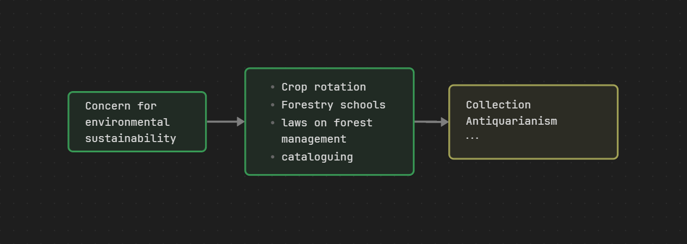

## Day 1
### Early Environmentalism
(Global Differences)
- A powerful, animate world that can bestow or withhold resources
- A potent force that humans ought to contemplate and learn from

(Medieval Period)
- Earth-centric and deterministic
- Man has God-given dominion over nature for 'sustenance'
- the tame >> the unknown and uninhabited

(Renaissance Environmentalism)

(Forestry and Natural history)

(Beach, Beauty and Beer: Nature Tourism)
- Rural Tourist Industry
- Fear of urbanizing the rural
- A 'proper' way to appreciate nature
- Making the experience comfortable
- The paradox of appreciation and exploitation

--- 
(Board)
Great Schism
Khmer --> <u>self-interest</u>
Jordin des Plantes