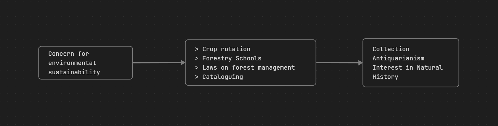

## Day 1
The Sierra Club, founded in **1892 by John Muir**, has historically been a significant advocate for environmental preservation in the United States.

**Main Advocacies and Evolution:**

- **Early Advocacies (Late 19th - Mid-20th Century)**:
	- Initially, the Sierra Club served as the primary advocate for the **preservation of large parks in the US**.
	- It spearheaded efforts to set aside **millions of acres of land specifically for wilderness**, a pioneering initiative that ultimately led to the Wilderness Act of 1964.
	- The organization successfully opposed the construction of dams in significant natural areas, including the Dinosaur National Monument and the Grand Canyon. These actions demonstrated its commitment to **wilderness preservation over economic development**. One of its former leaders, David Brower, proclaimed his allegiance to "wilderness for itself alone".
- **Growth and Mainstream Influence (1960s onwards)**:
	- The Sierra Club experienced substantial growth in membership, increasing from 20,000 in 1959 to 113,000 by 1970.
	- By the 1970s, and continuing into the 21st century, it established itself as **one of the most influential and well-funded environmental organizations in North America**, leveraging its Legal Defense Fund and lobbying activities.
	- As a mainstream environmental group, the Sierra Club adopted an **anthropocentric approach**, prioritizing the use of nature for the benefit of present and future human generations. This contrasts with more radical groups that emerged later, which hold biocentric beliefs, valuing nature intrinsically, irrespective of its human utility.
- **Changes and Perceived Moderation**:
	- By the 1970s, the Sierra Club was perceived by some as having been **eclipsed by more radical environmental groups**.
	- A segment of activists became disillusioned with mainstream organizations like the Sierra Club, viewing them as **ineffective, overly compromising, and bureaucratic**.
	- This dissatisfaction led prominent figures, such as David Brower, to leave the Sierra Club in 1970 and co-found more radical groups like Friends of the Earth. Similarly, Dave Foreman, a co-founder of Earth First!, explicitly stated his desire to create a radical wing that would make the Sierra Club "look moderate".
	- This shift indicates that while the Sierra Club remained a powerful force, its approach became seen as more moderate compared to the increasingly radical environmental movements advocating for more profound systemic changes beyond mere conservation or pollution control.
--- 
When the Sierra Club first started, its main advocacies were primarily focused on the preservation of natural landscapes and wilderness areas in the United States.

The main advocacies of the Sierra Club when it first started include:

- **Preservation of Large Parks:** For several decades after its founding in 1892 by John Muir, the Sierra Club was the **principal advocate for the preservation of large parks in the US**.
- **Setting Aside Wilderness:** It initiated and led efforts to **set aside millions of acres of land specifically for wilderness**. This was considered an unprecedented effort that ultimately led to the **Wilderness Act of 1964**.
- **Opposition to Damming Natural Areas:** The organization successfully campaigned against the construction of dams in significant natural sites, specifically **opposing the damming of the Grand Canyon and a dam in Dinosaur National Monument**. This demonstrated a commitment to **wilderness preservation over economic development**. David Brower, a former leader, expressed allegiance to "wilderness for itself alone".
--- 
## Day 2

### Early Environmentalism
#### Historical Perceptions of Nature and the Environment
1. Powerful, animate world that can bestow or withhold resources
2. Potent force that humans ought to contemplate and learn from
3. Untamed nature as a threat to survival, livelihoods, and salvation, and thus something to be dominated
#### Medieval Period (Europe)
- Earth-centric and deterministic
- Man has God-given dominion over nature for "sustenance"
- The tame >> the unknown and uninhabited
### Renaissance Environmentalism
#### Age of Reason, Enlightenment, and Capitalism
> "Why should I insist on the great plenty of Waters brought from the most remote and hidden Places, and employed to so many different and useful Purposes? Upon Trophies, Tabernacles, sacred Edifices, Churches and the like, adapted to divine Worship and the Service of Posterity? Or lastly, why should I mention the Rocks cut, Mountains bored through, Vallies filled up, Lakes confined, Marshes discharged into the Sea, Ships built, Rivers turned, their Mouths cleared, Bridges laid over them, Harbours formed, not only serving to Men's immediate Conveniences, but also opening them a way to all Parts of the World"
#### Forestry and Natural History

#### Gardens of Eden
- Provided a foil to wild landscapes
- Showed man's mastery of nature and ability to collect exotic pieces
#### Romanticizing Nature
...
#### Beach, Beauty, and Beer: Nature Tourism
- Rural Tourist Industry
- Fear of urbanizing the rural
- A "proper" way to appreciate nature
- Making the experience comfortable
- The paradox of appreciation and exploitation
#### The Adorable, The Abominable, and Hoomans
- The Society of Prevention of Cruelty to Animals (SPCA), London 1820s
### Urbanization and Industrialization
#### Industrial Revolution
- General increase in consumption of fossil fuels
- Results in the general increase of Carbon Dioxide
#### Urbanization
- Economic activity concentrated in high population density locations --> capitalism cutting costs of production in rural areas
- Start of a wave of forest loss
#### Conservation
- "Planned Management"
- **Gifford Pinchot** --> one of the earliest conservationists
- Appointed as head of the Division of Forestry in US (1898)
- Advocated scientific management, sustainable yield, full utilization, fire prevention, reforestation

> *"When there's smook, there is brass"* --> pollution $=$ economic progress

#### Reintegration of Nature in the Urban 
- Urban Parks were more easily established because they did not threaten the status quo
- <u>**Return to the country**</u>: widely-spread suburban homes with gardens, separated by ample wood
- Industrialization brought people to the cities but also provided both the means and the motive to travel from the city to the countryside
- An increase in perceived manliness by being capable in nature
	- Boy Scouts (1907) England
	- Characters like Tarzan
	- "Civilization" --> love for nature
	- A "civilized way" of loving nature
#### Preservation
> *"Keep close to nature's heart
> And break clear away,
> Once in a while,
> And climb a mountain
> Or spend a week in the woods.
> Wash your spirit clean"*
- John Muir (1838-1914) --> "John of the Mountains", "Father of the National Parks"
- Advocate of <mark class="hltr-yellow">preservation</mark>
	- Maintain the presently "wild" condition, valuing nature for its transcendental, spiritual values
	- First President of the Sierra Club
	- Extended National Integrated Protected Areas System (ENIPAS) (RA 11038, s2018)
		- **effective administration of this area is possible only through cooperation among national government, local government and concerned private organizations ~={PastelGreen}(and concerned non-government organizations and local communities)=~**
		- ~={PastelGreen}The System shall recognize conservation areas and management regimes being implemented by local government units, local communities, and indigenous people=~
		- ~={PastelGreen}As part of heritage preservation and pursuant to the need to conserve biologically significant areas, the territories and areas occupied and conserved for and by IPs and communities shall be recognized, respected, developed, and promoted.  =~
		- ~={PastelGreen}The ICCs and IPs shall have the responsibility to govern, maintain, develop, protect, and conserve such areas, in accordance with their IKSP and customary law, with full and effective assistance from the NCIP, DENR, and other concerned government agencies...=~

> *"In the end, nature-loving was not enough to curtail degradation of natural resources for economic progress—it focused on what was beautiful, spiritual, recreational, and turned almost a blind eye to what was degraded to achieve the comforts of the Industrial Age"*

### Conservation and Preservation

| **Conservation**                                                    | **Preservation**                                    |
| ------------------------------------------------------------------- | --------------------------------------------------- |
| Advocate for Maximum but sustainable use of environmental resources | Advocate for limited use of environmental resources |
| "Use as much as we can without collapsing the environment"          | "Use a little as possible form the environment"     |

In the Global South, it is led mostly by people instead of NGOs, but the motive behind campaigns vary.

It started mostly with government-imposed conservation and preservation, but over time government and organization found themselves in either end of the spectrum

#### Reasons for participating in Activism
1. Biographical Availability
	- Refers to the absence of personal constraints that might make it more difficult or risky for individuals to participate in activism
	- Absence of personal constrains
	- ex. --> full-time employment, family responsibilities, or other commitments that require significant time and resources
2. Structural Availability
	- Refers to the extent to which an individual's social roles and obligations allow them the time and the freedom to participate in social movements or activism
	- Position within social networks and their access to information about mobilization opportunities
3. Political Engagement
	- Encompasses an individual's interest, knowledge and perceived efficacy in the political sphere
	- ex. --> individuals with strong political engagement may be more likely to seek  out opportunities to express their views through activism