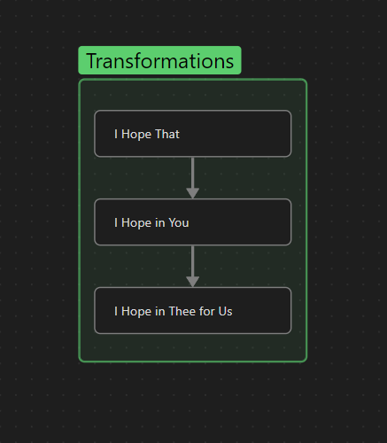

according to Gabriel Marcel in his essay "Sketch of a Phenomenology and Metaphysic Hope"
### Existential Phenomenology
- Grounded in human experience, which included subjectivity (emotion) and intersubjectivity (relation)
> "*Giving the phenomenon the dignity of concept*" (Jean-Luc Marion)

### Marcel's Strategy
- Christian Existentialism
	- Philosophy: God as a possibility
	- Theology: God as a certainty
- Phenomenological: purification of experience
	- Phenomenology allows us to get to the very core or the foundation of the experience
- Do we really know what hope is?

### Life as Captivity
- Ultimately, hope arises as a response to our recognition that human life is a kind of captivity.
- Fundamental Captivity ⟶ being just short of flourishing/fulfilment
	1. {"↳ "} flourishing/fulfilment is out of reach.
	2. Longing for a life that is unobtainable
	3. Perhaps if we numb ourselves to that captivity, we will be able to forget that we are captive at all.
- **<u>Hope</u>** arises as a response to this captivity.

### Optimism and Pessimism
- Optimist ⟶ relies on a kind of superiority
	1. {"↳ "} relies on a kind of distance & superiority allowing to see what others can't
	2. everything will work out in the end
	3. not really invested in the situation they find themselves in
	4. unable to come to terms with the gravity of the situation
- Pessimist ⟶ also relies on superiority
	1. {"↳ "} Opposite of optimism only in the sense that due to superiority, they know that everything is doomed
- Hope recognizes the complexity of reality, the positive and negative.
	- It can not be declared definitively a positive **OR** negative outcome

### Capitulation vs Acceptance
> "*To capitulate, in the strongest sense of the word, is not only, perhaps is not all, to accept the given sentence or even to recognize the inevitable as such, it is to go to pieces under this sentence, it is to disarm before the inevitable. It is at bottom to renounce the idea of remaining oneself, it is to be fascinated by the idea of one's own destruction to the point of anticipating this very destruction*"
> 
> "*To accept on the contrary, can mean to hold on and to keep a frim hold on oneself, that is to say to safe guard one's integrity.*" 

##### If we take seriously the gravity of the situation, the response is twofold.
| Capitulation                                     |                                          Acceptance |
| :----------------------------------------------- | --------------------------------------------------: |
| Inability to see past one's self-destruction     | Life under the impression of complete self-reliance |
| Unable to look past the gravity of the situation |          Maintains dignity at the cost of isolation |

### Stoicism
- Since I can only rely on myself, I will tend <u>only to myself</u>. This comes at the price of isolation
- Not hope.

### Process and Patient
- Hope ⟶ part and parcel of our experience of undergoing a process
- The only attitude that can aptly guide and govern a process of growth ⟶ Patience
- The person we are least patient with ⟶ **Ourselves**

### Waiting
- a kind of Sacrament
- Opens the door to a kind of:
	 1. Anticipation that does not force its own rhythm
	 2. Vigilance that does not impose a certain outcome

### What It Means to Hope in Someone
> "*To love anybody is to expect something from him, something which can neither be defined nor foreseen; it is at the same time in some way to make it possible for him to fulfill this expectation. Yes, paradoxical as it may seem, to expect is in some way to give: but the opposite is none the less true; no longer to expect is to strike* with sterility the being from whom no more is expected, it is then in some way to deprive him or take from him in advance what is surely a certain possibility of inventing or creating." (49)
- To say that I no longer hope in someone, is to strike them with sterility, to say that no growth or change is possible in you.

>"*…the less life is experienced as a captivity the less the soul will be able to see the shining of that veiled, mysterious light, which, we feel sure without any analysis, illumines the very center of hope's dwelling-place*" (32)
- To hope is to allow the slimmest of chance for growth or change to take place, expected or not. Attended by the attitude of patience

### What Hope is Not
- Optimism (or Pessimism)
	1. {"- "} Lack of immersion/investment
	2. Smugness due to feigned superior wisdom
	3. Condescension
- Capitulation
	- Is to fall to pieces and become fascinated with his own destruction
- Acceptance
	1. {"- "} "*The despairing man not only contemplates and sets before himself the dismal repetition, the eternalization of a situation in which he is caught like a ship in a sea of ice. By a paradox which* is difficult to conceive, he anticipates this repetition."
	2. Isolates one's self

### Patience, creativity, openness *in time*
> "*…despair is in a certain sense the consciousnesses of time as closed or, more exactly still, of time as a prison—whilst hope appears as piercing through time… One cannot say that hope sees what is going to happen; but it affirms is <u>if</u> it saw*" (53)
- Hope is not a guarantee a particular outcome, but it affirms of something it cannot see.

> "*In face of a particular trial, whatever it may be, which confronts me and which must always be but a specimen of the trial of humanity in general, I shall always be exposed to the temptation of shutting the door which encloses me within time, as though the future, drained of its substance and its mystery, were no longer to be anything but a place of pure repetition*"
- The immersion that hope calls for recognizes that even the slimmest chance is possible

### Faith ⇔ Hope (intertwined)
- Wager: Love, Faith & Hope hold analogous structures, and cannot be separated in each other

#### Hope Is Atechnical ⟶ It does not impose a particular method by which certain things must take place

### Hope is Unconditional
> "*This is what determines the ontological position of hope—absolute hope, inseparable from a faith which is likewise absolute, transcending all laying down of conditions, and for this very reason every kind of representation whatever it might be.*" (46)
- Is it possible to trust unconditionally?
- Condition ⟶ Transaction vs Gift (given freely and unconditionally)

### I Hope in Thee for us
- To love someone is to exclaim 'You shall not die'
	1. {"↳ "} An affirmation that this person has a value that transcends death
	2. A value I recognize and affirm as a mortal
	3. The only way this value is guaranteed if this value is taken care of by some third party **<u>Thee</u>**
	4. This **<u>Thee</u>** safeguards the integrity of the entire human race.
	5. Without this **<u>Thee</u>** the act of hope becomes absurd
	> "*It appears as a response of the creature to the infinite Being to whom it is conscious of owing everything that it has and upon whom it cannot impose any condition whatsoever without scandal. From the moment that abase myself in some sense before the absolute Thou who in his infinite condescension has brought me forth out of nothingness, it seems as though I forbid myself ever again to despair, or, more exactly, that I implicitly accept the possibility of despair as an indication of treason, so that I could not give way to it without pronouncing my own condemnation*"